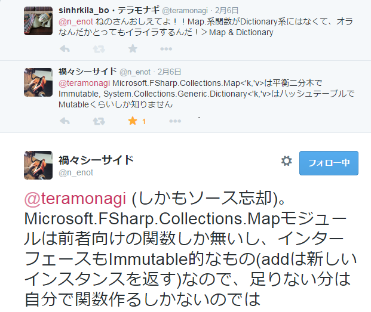

- title : F#談話室(17)
- description : something about F#
- author : teramonagi
- theme : sky

***
<!--
めも１：
Reveal.initializeでサイズとかスライド番号有無とかの調整ができる
書き方
- https://github.com/hakimel/reveal.js/
packages\FsReveal\fsreveal\template.html
でいじる

めも２：
テーマは以下にある
FsReveal\reveal.js\css\theme
-->	

### F#談話室(17)

# よくわからないことを質問したら、談話室の神々が助けてくれた件

## @teramonagi

***
### Who am I?

- @teramonagi
- /R/F#/C++/Ruby/VBA
- **.NETわからない勢**
- 「あれ読めこれやれ」的なアドバイスを強く求めます！！！
- このスライドもF#で作ってます ⇒ [FsReveal](http://fsprojects.github.io/FsReveal/)

***
## 内容
- よくわからなかったことをF#談話室で質問したら見事に解決していただきました！
- 以下、質問(Q)とその回答(A)が続きます

***
### [Q1]判別共有体の要素数が欲しい

- 以下のコードだと、`Moge |> size`とかやると3ってなってほしい	
- どう書いたらいいの、僕…

    type Hoge = 
        | A = 1 
        | B = 2
    type Moge = 
        | M1 of Hoge
        | M2

***
### [A1]Reflection使え
- `Microsoft.FSharp.Reflection`を使うと良いとのことでした
- 今回のケースだと以下でOK、汎用的にしたければ再帰でがんばれ

    let length type_name = 
        Reflection.FSharpType.GetUnionCases(type_name) |> 
        Array.map (fun u -> 
            let field = u.GetFields()
            match Array.length field with
                | 0 -> 1
                | _ -> System.Enum.GetValues(field.[0].PropertyType) |> 
					Seq.cast<Hoge> |> Seq.length
        ) |>
        Array.sum
	//3と表示される
    typeof<Moge> |> length 

***
### [Q2]オーバーロードし過ぎ…
- 格好つけようとしたら`int`が足せなくなった！！！
- ちゃんとモジュール(名前空間？)なんかを使えってこと？

    type Hoge = | A | B
    let (+) (lhs: Hoge) (rhs: Hoge) = 
        match (lhs, rhs) with
        | (A, _) -> A
        | (_, _) -> B
    //動く
    B + B
    //この式に必要な型は Hoge ですが、ここでは次の型が指定されています int    
    let x =  2 + 3

***
### [A2]moduleちゃんと分けるか、inline使え
- 基本、moduleや名前空間でちゃんと分けよう
- コンパイルするならinline付けておけばコンパイル時に展開されるのでOK

***
### [Q3]配列の最大要素のインデックスを取りたい
- indexと値をzipしてmaxby, mapi
- いい書き方が知りたい

    let x = [|1; 5; 2; 3|]
    let maxX = x |> Array.max
    [|0..(Array.length x - 1)|] |> Array.filter (fun i -> x.[i] = maxX)

***
### [A3]mapi使うといいかも？
- こんなんどうでしょう

    x |> 
	    Array.mapi (fun i y -> if y=maxX then i else -1) |> 
		Array.filter ((<>) -1)

***
### [Q4]System.Array is 何…
- `Enum.GetValues`の結果が`System.Array`になる
- F#の型に持っていくのが辛い

    type Hoge = 
        | A = 0
        | B = 1
    let elements = System.Enum.GetValues(typeof<Hoge>) 
    elements |>
        Seq.cast |>
        Seq.map (fun o -> o |> unbox<Hoge>) 

***
### [A4] 普通にcastしましょう
- ダウンキャスト`:?>`か`Seq.cast<Type>`を使おう

    elements |> Seq.cast<Hoge>
    elements :?> Hoge []

***
### [Q5]MapとDictionaryの違いがよくわかんねぇよ…(1) 
- KeyValue関数使ったり使わなかったり...
- .NET周りのお勉強は何をやったらいいの…

***
### [A5]MapとDictionaryの違いがよくわかんねぇよ…(2) 
- これを読めばいいのでは…？

***
### [A5]MapとDictionaryの違いがよくわかんねぇよ…(3)
- ありがとう、[ねのさん](https://twitter.com/n_enot)！！！

***
### (おまけ)数式も書ける in FsReveal

$ f(x) = x^3 + \frac{1}{3} x^2$

***
# End
